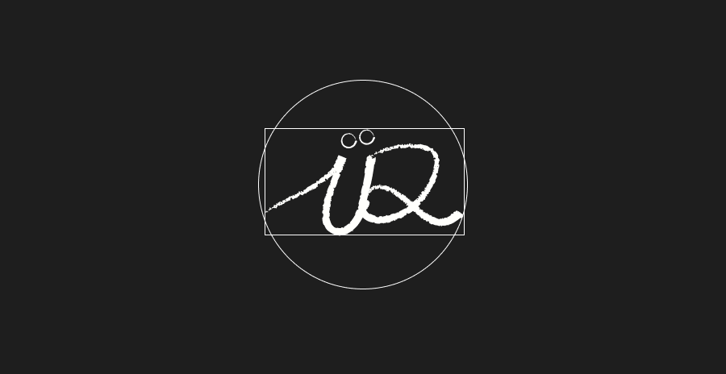

# Portfolio perso

## Présentation
Le projet est de mettre un pied dans le dev web avec JS et React en faisant mon portfolio de projets persos en utilisant React et ensuite l'héberger. L'idée n'est pas de trop se prendre la tête mais d'experimenter un maximum, prendre des habitudes comme avec les commits Git par exemple ! Le projet est fouilli mais avec le temps, je passerais au fur et a mesure des coups de balais pour rendre le projet le plus propre.

---

## Structure du projet

Seuls les fichiers principaux sont mentionnés

```
portfolio/
│
├── index.html              # Ce que le navigateur recoit
│
├── src/                    # Coeur du projet
│   └── assets/css
│       └── index.css       # Feuille de style générale
│       └── navbar.css      # Feuille de style de la navbar
│       └── scheme.css      # Feuille de style des couleurs/polices
│
├── components/
│       └── elements        # Dossier des éléments dynamiques
│
├── App.jsx                 # Squelette du projet
│
├── main.jsx
│
└── README.md               # Vue d'ensemble du projet
```

---

## Setup du projet

``` git clone https://github.com/buchtioof/portfolio.git ```
``` npm run dev ```
---

## Mise en ligne

[Lien vers le site](https://www.ramziidir.dev) hébergé sur Vercel

---

## Changelog

**Version 0** — Commit de base, demarrage du projet React avec Vite

**Version 0.1** — Création de la homepage et définition des pages + animations

**Version 0.2** — Finitions de la homepage, passage en one-page, ajout de la section Personnelle (développement futurs commits)

**Version 0.3** — Fin de la homepage, effet de scroll (thx [lenis](https://github.com/darkroomengineering/lenis/tree/main)), début du travail sur la workpage

**prévu : Version 0.4** - Workpage finie, passage a la page perso avec médias etc...

---

## Crédits

- [Phosphor Icons](https://github.com/phosphor-icons/react) pour les icones
- [Google Fonts](https://fonts.google.com/) pour les polices ([Instrument Serif](https://fonts.google.com/specimen/Instrument+Serif), [Sora](https://fonts.google.com/specimen/Sora/))
- [use-prefers-color-scheme](https://www.npmjs.com/package/use-prefers-color-scheme) pour détecter le theme utilisateur
- [Librairie reactbits](https://www.reactbits.dev/backgrounds/aurora)  (utilise [ogl](https://www.npmjs.com/package/ogl))
- [react-type-animation](https://www.npmjs.com/package/react-type-animation)
- [lenis](https://github.com/darkroomengineering/lenis/tree/main)
